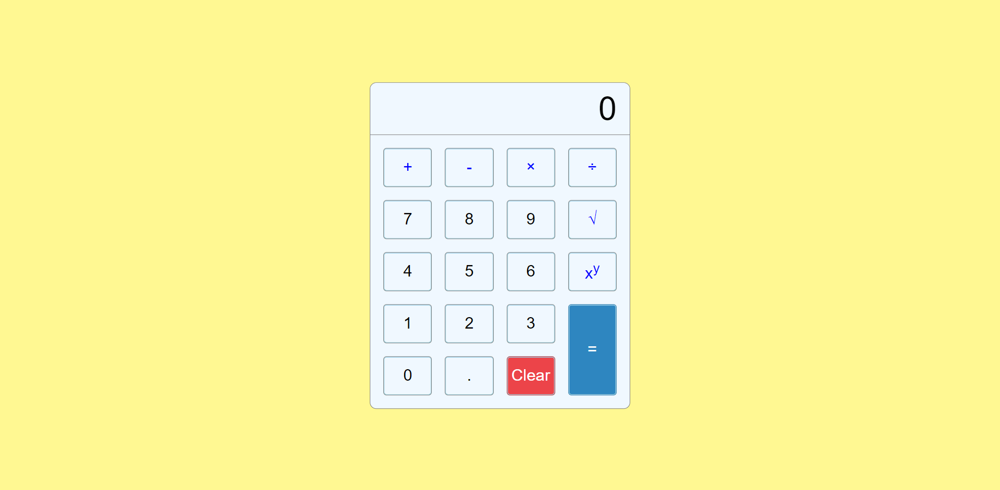

# Calculator

## About 

This is a basic calculator web application which includes operations of summing, substraction, multiplication, division, square root determination and exponentiation of integers and decimal numbers.

## Technologies 

- HTML5
- CSS3
- JavaScript
- Visual Studio Code 

## Purpose

JavaScript project for Seavus Code Academy.

## Author 

Riste Spasov
